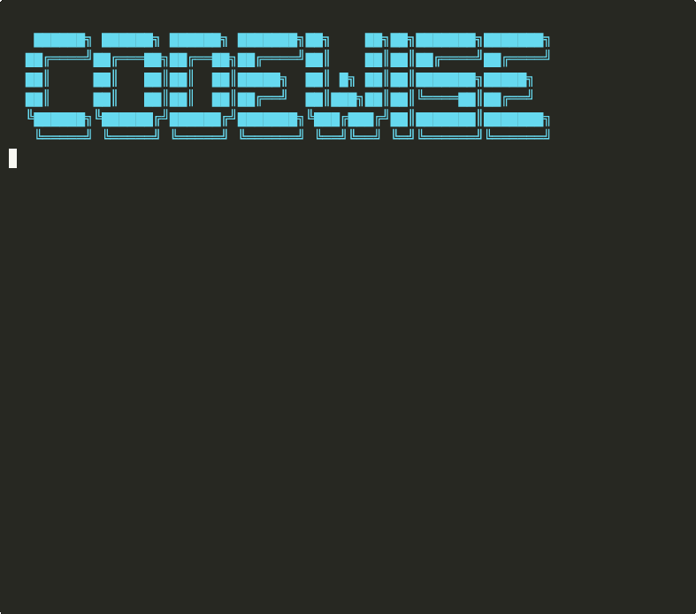

<p align="center">
  
</p>

# codewise

**LLM-agnostic code review, security scanning, test generation, and documentation — as CLI, MCP server, GitHub Action, or git hook.**

Works with **any LLM provider**: OpenAI, Anthropic, Google Gemini, Ollama, Azure OpenAI, AWS Bedrock — powered by [litellm](https://github.com/BerriAI/litellm).

## 🎬 Demo

<p align="center">
  
  <br>
  <em>codewise reviewing code, scanning for vulnerabilities, and generating tests — all from the CLI</em>
</p>

---

## Features

| Capability | Description |
|------------|-------------|
| **Code Review** | Bugs, performance, maintainability, best practices |
| **Security Scan** | OWASP/CWE classification, SARIF output for GitHub Security tab |
| **Test Generation** | Generates runnable tests (pytest, jest, go, junit) |
| **Doc Generation** | Docstrings, type hints, inline comments |
| **Configurable Rules** | Standard rule packs + custom regex/LLM rules |
| **Git Hooks** | Pre-commit & pre-push with configurable thresholds |
| **MCP Server** | Use from any MCP-compatible editor (VS Code, Cursor, etc.) |
| **GitHub Action** | Automatic PR reviews with SARIF upload |

## Quick Start

```bash
pip install codewise-ai
```

### Review code
```bash
# Review uncommitted changes
codewise review

# Review staged changes (pre-commit style)
codewise review --staged

# Review before pushing
codewise review --push

# Review a PR branch
codewise review --branch main

# Review specific files
codewise review src/main.py src/utils.py

# Security scan
codewise security --staged

# Generate tests
codewise testgen src/handler.py --framework pytest

# Generate docs
codewise docgen src/handler.py
```

### Configure
```bash
# Create .codewise.yaml in your repo
codewise init

# See active rules
codewise rules show

# List available rule packs
codewise rules list-packs
```

## Configuration

Create `.codewise.yaml` in your repo root:

```yaml
model: gpt-4o-mini
temperature: 0.1
min_severity: low
fail_on: high
output_format: terminal

rules:
  enable_packs:
    - python-best-practices
    - security-basics

  custom:
    - id: no-debug-flags
      pattern: "DEBUG\\s*=\\s*True"
      file_pattern: "*.py"
      severity: high
      message: "Remove debug flags before merging."

    - id: require-error-handling
      llm_check: "Ensure all HTTP calls have try/except."
      file_pattern: "*.py"
      severity: high

    - id: no-fixme-on-main
      pattern: "FIXME|HACK"
      file_pattern: "*.py"
      severity: medium
      branches: [main, master]

hooks:
  pre_commit:
    enabled: true
    fail_on: high
  pre_push:
    enabled: true
    fail_on: high
    max_files: 20
    timeout: 120
```

### Rule Types

| Type | Description | LLM? |
|------|-------------|------|
| **Regex** | Pattern-based, instant, no API calls | No |
| **LLM** | Natural-language instruction for the reviewer | Yes |
| **Composite** | Regex pre-filter + LLM analysis | Yes |

### Standard Rule Packs

| Pack | Rules | Languages |
|------|-------|-----------|
| `python-best-practices` | 6 | Python |
| `javascript-best-practices` | 4 | JS/TS |
| `security-basics` | 5 | All |
| `go-best-practices` | 3 | Go |
| `java-best-practices` | 3 | Java |
| `rust-best-practices` | 2 | Rust |

## Git Hooks

```bash
# Install pre-commit + pre-push hooks
codewise hooks install

# Check status
codewise hooks status

# Remove hooks
codewise hooks uninstall
```

The **pre-push hook** reviews all commits being pushed vs the remote branch. It blocks the push if findings exceed the configured severity threshold. Users can always bypass with `git push --no-verify`.

Configure hook behavior in `.codewise.yaml`:

```yaml
hooks:
  pre_push:
    enabled: true
    review: true
    security: true
    fail_on: high
    max_files: 20     # Skip if too many files (avoid slow pushes)
    timeout: 120      # Max seconds
```

## LLM Providers

codewise uses [litellm](https://github.com/BerriAI/litellm) — any model it supports works:

```bash
# OpenAI (default)
export CODEWISE_API_KEY=sk-...
codewise review

# Anthropic
codewise review --model claude-sonnet-4-20250514
export ANTHROPIC_API_KEY=sk-ant-...

# Google Gemini
codewise review --model gemini/gemini-2.0-flash
export GEMINI_API_KEY=...

# Ollama (local, free)
codewise review --model ollama/llama3.1

# Azure OpenAI
codewise review --model azure/gpt-4o-mini
export AZURE_API_KEY=...
export AZURE_API_BASE=https://your-deployment.openai.azure.com

# AWS Bedrock
codewise review --model bedrock/anthropic.claude-sonnet-4-20250514-v2:0
```

## MCP Server

Use codewise from any MCP-compatible editor:

```bash
# stdio transport (for VS Code / Cursor)
codewise mcp

# SSE transport (for web clients)
codewise mcp --transport sse --port 3000
```

### MCP Tools

| Tool | Description |
|------|-------------|
| `review_code` | Review code or diffs |
| `scan_security` | Security vulnerability scan |
| `generate_tests` | Generate test cases |
| `generate_docs` | Generate documentation |
| `check_rules` | Run regex rules (no LLM) |
| `list_rule_packs` | List available rule packs |

### VS Code MCP Config

```json
{
  "mcpServers": {
    "codewise": {
      "command": "codewise",
      "args": ["mcp"]
    }
  }
}
```

## GitHub Action

```yaml
name: Code Review
on: [pull_request]

jobs:
  review:
    runs-on: ubuntu-latest
    steps:
      - uses: actions/checkout@v4
        with:
          fetch-depth: 0

      - uses: naveenkumarbaskaran/codewise@v0.1.0
        with:
          api_key: ${{ secrets.OPENAI_API_KEY }}
          mode: both          # review + security
          model: gpt-4o-mini
          fail_on: high
          output_format: markdown

      # Optional: upload SARIF to GitHub Security tab
      - uses: naveenkumarbaskaran/codewise@v0.1.0
        with:
          api_key: ${{ secrets.OPENAI_API_KEY }}
          mode: security
          sarif_file: codewise.sarif

      - uses: github/codeql-action/upload-sarif@v3
        with:
          sarif_file: codewise.sarif
```

## Pre-commit Integration

```yaml
# .pre-commit-config.yaml
repos:
  - repo: https://github.com/naveenkumarbaskaran/codewise
    rev: v0.1.0
    hooks:
      - id: codewise-review
      - id: codewise-security
```

## Output Formats

| Format | Use Case |
|--------|----------|
| `terminal` | Interactive CLI (default), rich colors |
| `json` | Piping, programmatic use |
| `sarif` | GitHub Security tab, IDE integrations |
| `markdown` | PR comments, CI artifacts |

```bash
codewise review --format json | jq '.findings[] | select(.severity == "critical")'
codewise security --format sarif > report.sarif
codewise review --format markdown >> pr-comment.md
```

## Architecture

```
codewise/
├── cli.py              # Click CLI with subcommands
├── config.py           # YAML config loader (layered)
├── models.py           # Pydantic data models
├── rules.py            # Configurable rules engine
├── core/
│   ├── diff.py         # Diff parsing, language detection
│   ├── reviewer.py     # Code review engine
│   ├── security.py     # Security scanner
│   ├── testgen.py      # Test generation
│   └── docgen.py       # Doc generation
├── llm/
│   ├── provider.py     # litellm wrapper
│   └── prompts.py      # Prompt templates
├── integrations/
│   └── git.py          # Git diff extraction + hook management
├── mcp/
│   └── server.py       # MCP server
└── output/
    ├── terminal.py     # Rich terminal output
    ├── json_fmt.py     # JSON output
    ├── sarif_fmt.py    # SARIF 2.1.0 output
    └── markdown_fmt.py # Markdown output
```

## License

MIT
